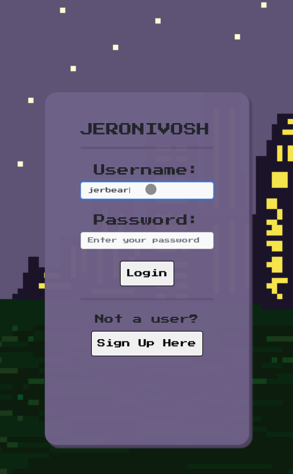

# JERONIVOSH


[](https://www.mit.edu/~amini/LICENSE.md)

## Table of Contents
* [Description](#description)
* [GIFs of Project](#gifs-of-project)
* [Technologies Used](#technologies-used)
* [Code Snippet](#code-snippet)
* [Repository Link](#repository-link)
* [Deployed Link](#deployed-link)
* [Authors](#authors)
* [Acknowledgments](#acknowledgments)

## Description 

In this application, our team has created a choice-based novel game where users can experience a story in an interactive and fun way using React.js. Users will be making decisions as a cat that is lost in a big city, and is given 9 lives at the start of the game. Every decision the user makes can affect the number of lives left. Each scene is accompanied by pixilart animations to enhance the story. With every decision, the current page is being re-rendered using react.js. Users are given two options on what the cat should or shouldn't do and each decision button is given an ID that helps keep track on what scene to render next. The user's progress is being tracked and stored using MongoDB along with the number of lives the cat has left and the usernames of the player that signed up. The user's progress is being updated with put requests.

## GIFs of Project

Here's a GIF of the application.


Here is a GIF of our application viewed on a mobile device. 



## Technologies Used
* [react](https://reactjs.org/)
* [axios](https://www.npmjs.com/package/axios)
* [express](https://www.npmjs.com/package/express)
* [if-env](https://www.npmjs.com/package/if-env)
* [mongoose](https://mongoosejs.com/)
* [react-router-dom](https://reactrouter.com/)
* [MongoDB](https://www.mongodb.com/)
* [Node.js](https://nodejs.org/en/)
* [morgan](https://www.npmjs.com/package/morgan)
* [bcrypt.js](https://www.npmjs.com/package/bcryptjs)
* [Hover.css](https://ianlunn.github.io/Hover/)

## Code Snippet

In this code snippet, this is the game logic wherein we set a variable to grab the value of the decision the user makes. If the user's decision is a bad choice, the cat loses a life and continues on to the next scene in the game otherwise, the cat won't lose a life but will move on to the next scene. The user progress is updated and saved with each click of a decision.

```
    function choice(event) {
        event.preventDefault();

        let value = event.target.value;

        if (storyline[user.level].decision) {
            if (storyline[user.level].badchoice) {
                setUser({ ...user, "level": storyline[user.level].decision[value], "lives": user.lives - 1 });
            }
            else {
                setUser({ ...user, "level": storyline[user.level].decision[value] });
            }
        } else if (storyline[user.level].end === true) {

            API.findHighScore(user.username).then(res => {
                API.newHighScore(user.username, user.level, user.lives);
            })
            setEndGame(false)
        } else {
            setUser({ ...user, "level": user.level + 1 });
        }
    };
```

## Repository Link
* [GitHub Repository](https://github.com/joshglugatch/JERONIVOSH)

## Deployed Link
* [See Live Site](http://jeronivosh.herokuapp.com/)

## Authors 

[Jerri Fong](https://janessaref.herokuapp.com)

[](https://github.com/janessaref)

[](https://linkedin.com/in/janessafong)


[Josh Glugatch](https://josh-glugatch.herokuapp.com/)


[](https://github.com/joshglugatch)

[](www.linkedin.com/in/joshua-glugatch)


[Jon SanPedro](https://jsp-react-portfolio.herokuapp.com/)

[](https://github.com/jsp117)

[](https://www.linkedin.com/in/jonathansanpedro/)


[Ivan Torres](https://ivan-torres-mia.herokuapp.com/)

[](https://github.com/IvanTorresMia)

[](www.linkedin.com/in/ivan-torres-0828931b2)

## Acknowledgments
* [StackOverFlow](https://stackoverflow.com/)
* We would like to acknowledge our instructors in the bootcamp, Jerome Chenette, , Roger Le, Manuel Nunes, Kerwin Hy, and Mahisha Gunasekaran.

